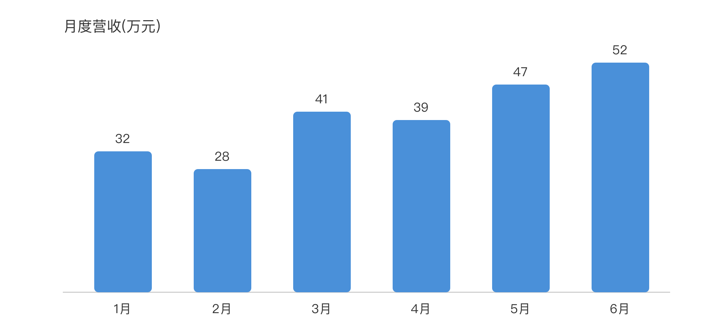
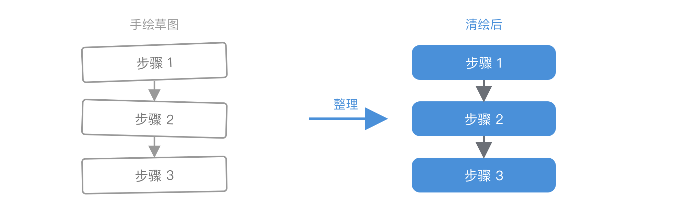

# 铸图 (figureforge)

一个 Claude Code **插件 / 技能**:**把想法 / 数据 / 草图,用代码变成一张好看的图,并交付成真实、可下载的文件(SVG + PNG)。**

重点不在"画"——Claude 本来就能在对话里画个内嵌 SVG。重点在**交付**:把图**存成真实文件、转成 PNG、递回给你**,让你能留存、放进文档、二次编辑。这"最后一公里"正是普通回答会省略、而本项目专门解决的。

它画的是**结构类的图**:流程图、架构图、示意图、对比图、时序图、时间线,以及数据图表(柱状/折线/饼/散点)。它**不做** AI 文生图(凭想象作画),那是对话里图像工具的活。

## 三种用法(同一套引擎)

1. **你说画什么** —— "画个流程图,说明我的部署流程"
2. **你甩给它数据** —— 给一张表 / 一组数字,它选合适的图型再画
3. **你给它草图** —— 丢一张手绘草图,它重画得干净漂亮

出来的都是统一风格的 **SVG + PNG**,默认存进当前项目的 `diagrams/` 子目录(不在项目里就存 `~/Downloads`)。

## 效果示例

下面三张分别对应上面三种用法——都是铸图**用代码生成、交付的真实文件**:

**① 你说画什么 → 流程图**


**② 你给数据 → 图表**(输入:1月32 2月28 3月41 4月39 5月47 6月52 万元)



**③ 你给草图 → 清绘**(潦草手绘 → 对齐清晰)



## 安装(三选一)

| 方式 | 适合 | 怎么做 | 触发名 | 更新 |
|------|------|--------|--------|------|
| **A. 下载 `.skill` 一键装**(最简单) | 想直接用、不折腾 | 下载本仓库的 [`figureforge.skill`](figureforge.skill) → 在 Claude 里打开该文件 → 点卡片上的 **Save skill** | `/figureforge` | 重下新包再装 |
| **B. 拷技能文件夹** | Claude Code 用户 | 把 `skills/figureforge/` 整个文件夹拷进 `~/.claude/skills/` | `/figureforge` | `git pull` / 重拷 |
| **C. 装成 plugin** | 想要显式命令+版本管理 | 在 Claude Code 里跑下面两行 | `/figureforge:figureforge` | marketplace 一键升级 |

方式 C 的命令:

```text
/plugin marketplace add yaz720/figureforge
/plugin install figureforge@yaz720
```

三种方式装好后,**相关请求都会自动触发**;方式 C 额外给一个 100% 可靠的显式入口 `/figureforge:figureforge`。

> 说明:`SKILL.md` 是技能本体,自包含;`.claude-plugin/`(plugin.json + marketplace.json)只是"分发+显式命令+更新"的包装。所以方式 A/B 不需要 plugin 那层也能用。

## 依赖

PNG 转换用 [`librsvg`](https://gitlab.gnome.org/GNOME/librsvg) 的 `rsvg-convert`(质量好、中文字体正常):

```bash
brew install librsvg
```

没装也能跑——会退回 macOS 自带的 QuickLook,只是画质差些。

## 本地开发 / 自用

```bash
# 在仓库根目录起一个会话来试
claude --plugin-dir .
# 或把技能软链进 skills 目录当普通技能自动加载
ln -s "$(pwd)/skills/figureforge" ~/.claude/skills/figureforge
```

改完技能后:`/reload-plugins` 重新加载;若要更新可下载包,重新打包 `.skill`(见下)。

## 手动操作

```bash
# SVG → PNG(3 = 放大 3 倍)
skills/figureforge/scripts/svg2png.sh 输入.svg 3 输出.png

# 重新生成可下载的 .skill 包(改过 SKILL.md 后,用 skill-creator 的脚本)
python -m scripts.package_skill <此仓库>/skills/figureforge <此仓库>
```

## 结构

```
figureforge/
├── figureforge.skill        # 打包好的可下载安装包(方式 A)
├── .claude-plugin/
│   ├── plugin.json          # 插件清单
│   └── marketplace.json     # marketplace 目录(方式 C 据此安装)
├── skills/
│   └── figureforge/
│       ├── SKILL.md         # 技能:触发描述 + 工作流(核心)
│       └── scripts/
│           └── svg2png.sh   # SVG → PNG(封装 rsvg-convert,带 QuickLook 兜底)
└── README.md
```
